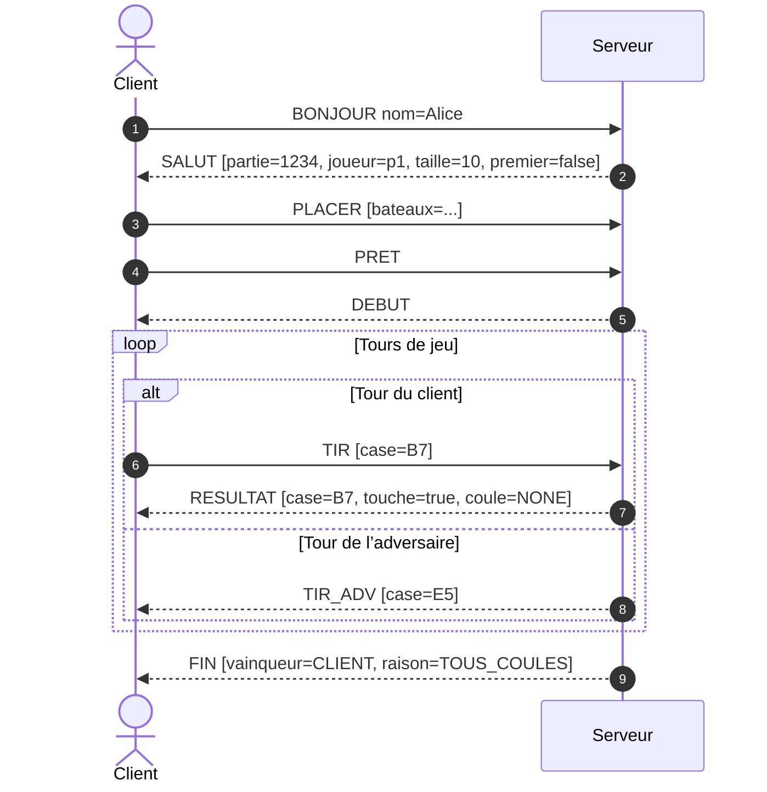
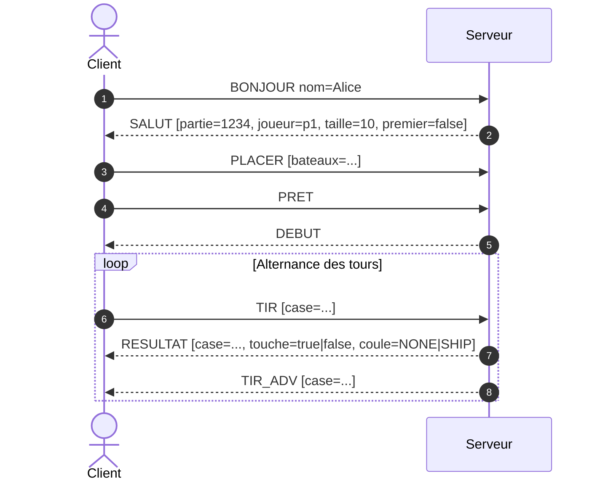
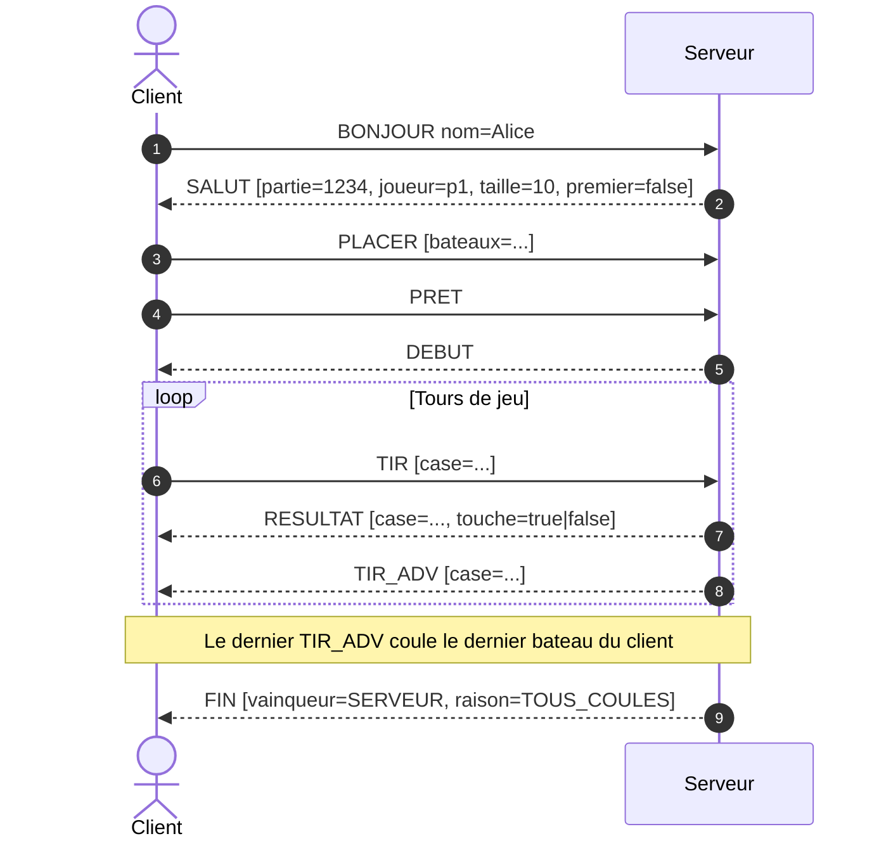
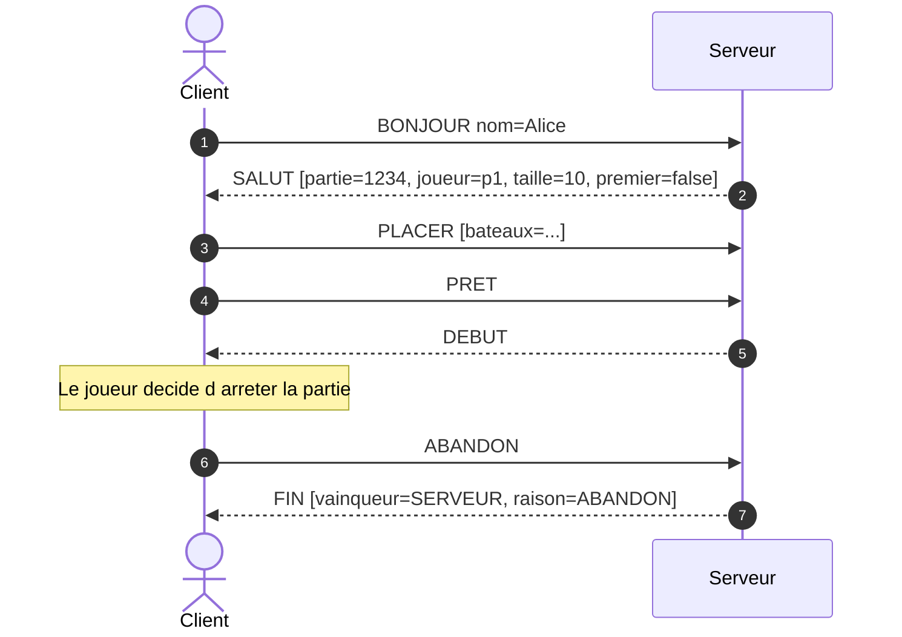

# 1.Quel service est rendu par le serveur ?

Le serveur rend un service de jeu en ligne pour la bataille navale : il accepte les connexions, crée et gère les sessions, maintient l’état de référence des plateaux et des tours, applique les règles officielles du jeu, arbitre les actions et notifie les événements (démarrage, résultats des tirs, fin de partie) via un protocole applicatif textuel fiable sur TCP.

# 2.Que demande le client ?

Le client demande au serveur d’ouvrir une session et de l’y inscrire, d’autoriser le placement de ses navires puis de valider ses actions pendant la partie (notamment les tirs), en retour d’obtenir l’état mis à jour et les décisions d’arbitrage, et plus largement de pouvoir suivre l’évolution de la partie jusqu’à son terme.

# 3.Que répondra le serveur à la demande du client ?

À chaque demande du client, le serveur répond par un message explicite cohérent avec l’état courant : il confirme l’inscription et les paramètres de la session à l’initialisation, accuse réception du placement et annonce le début lorsque tous les joueurs sont prêts, renvoie pour chaque tir un verdict précis (touché, coulé ou manqué) et informe des actions adverses, puis déclare la fin avec le vainqueur et la raison.

# 4.Qu’est-ce qui est donc à la charge du serveur ?

Sont à la charge du serveur la logique complète du jeu et la cohérence des données : vérification des placements, gestion du tour par tour, contrôle de validité des coordonnées, calcul des résultats et des conditions de fin, synchronisation et diffusion de l’état aux clients, ainsi que la tenue simultanée de plusieurs parties sans interférences.

# 5.Qui du serveur ou du client fixe les règles du jeu ?

 Les règles du jeu sont fixées par le serveur, qui agit comme autorité de vérité et arbitre central ; le client ne fait que proposer des actions et afficher les informations reçues, de sorte que l’uniformité des décisions, la prévention des divergences et la reproductibilité des parties soient garanties par une implémentation unique côté serveur.

# 6. Structure et champs d’un message envoyé par le client (Client → Serveur)

Tous les messages sont envoyés en **UTF-8**, sous forme de texte, et se terminent par **\n**.
 Le format général est :

```
COMMANDE k1=v1;k2=v2\n
```

Chaque champ est séparé par un point-virgule `;`, et chaque paire clé-valeur est séparée par un signe égal `=`.
 Les valeurs ne contiennent pas de saut de ligne.

| **COMMANDE**                    | **Champ(s)**             | **Expliquer**                                                |
| ------------------------------- | ------------------------ | ------------------------------------------------------------ |
| **BONJOUR**                     | nom                      | Nom d’affichage du joueur (caractères ASCII simples). Sert à l’identification initiale. |
| **PLACER**                      | bateaux                  | Disposition du plateau de jeu. Format : `A5:A1H,B4:B2V,C3:C5H,S3:D7H,D2:J10H` (coordonnées et orientation des bateaux). |
| **PRET**                        | (rien)                   | Le client informe le serveur qu’il a terminé la phase de placement. |
| **TIR**                         | case                     | Coordonnée de tir, par exemple `B7`.                         |
| **ABANDON**                     | (rien)                   | Le client se rend et abandonne la partie.                    |
| **RESUME** *(Partie 2)*         | partie;joueur            | Reconnexion à une partie existante : identifiant de la partie et du joueur. |
| **ROOM_REJOINDRE** *(Partie 2)* | salle;mdp(optionnel)     | Rejoindre une salle spécifique, avec un mot de passe si nécessaire. |
| **CHAT** *(Partie 2)*           | texte                    | Message texte envoyé dans le chat (UTF-8).                   |
| **AUTH** *(Partie 2)*           | methode;jeton(optionnel) | Autorisation d’accès. Exemple : `methode=ANON` pour une connexion anonyme. |

------

# 7. Structure et champs d’un message envoyé par le serveur (Serveur → Client)

Même format que côté client :
 `COMMANDE k1=v1;k2=v2\n` (UTF-8, terminé par `\\n`)

| **COMMANDE**               | **Champ(s)**                         | **Expliquer**                                                |
| -------------------------- | ------------------------------------ | ------------------------------------------------------------ |
| **SALUT**                  | partie;joueur;taille;premier         | Message de bienvenue après `BONJOUR`. Contient l’identifiant de la partie, l’identifiant du joueur, la taille du plateau, et un booléen indiquant si le joueur commence (`true`/`false`). |
| **DEBUT**                  | (rien)                               | Indique que la partie commence (les deux joueurs sont prêts). |
| **RESULTAT**               | case;touche;coule                    | Résultat du dernier tir du client : `case` est la position tirée, `touche` indique si la case est touchée (`true/false`), `coule` indique si un bateau est coulé (`NONE` ou le nom du bateau). |
| **TIR_ADV**                | case                                 | Indique la position du tir effectué par l’adversaire (IA ou autre joueur). |
| **FIN**                    | vainqueur;raison                     | Fin de la partie. `vainqueur` = `CLIENT` ou `SERVEUR`. `raison` = `TOUS_COULES`, `ABANDON`, `DECONNEXION`, etc. |
| **RESUME_OK** *(Partie 2)* | partie;joueur;phase;premier;prochain | Confirmation de la reconnexion réussie : phase actuelle (`PLACEMENT`, `EN_JEU`, `FIN`), si le joueur commence (`true/false`), et qui joue ensuite (`CLIENT` ou `ADVERSAIRE`). |
| **ROOMS** *(Partie 2)*     | liste                                | Liste simple des salles disponibles, séparées par des virgules (ex : `Public1,Public2,VIP`). |
| **TIMER** *(Partie 2)*     | resteMs;phase                        | Informations de temps restant (en millisecondes) et phase actuelle du jeu. |

------

## Exemple d’échange typique

```
Client → BONJOUR nom=Alice
Serveur → SALUT partie=1234;joueur=p1;taille=10;premier=false
Client → PLACER bateaux=A5:A1H,B4:B2V,C3:C5H,S3:D7H,D2:J10H
Client → PRET
Serveur → DEBUT
Serveur → TIR_ADV case=E5
Client → TIR case=B7
Serveur → RESULTAT case=B7;touche=true;coule=NONE
Serveur → FIN vainqueur=CLIENT;raison=TOUS_COULES
```


# 8.Elaborer la séquencement des messages échangés entre le client et le serveur




# 9.Définir précisément les diagrammes qui décrivent : une partie gagnée, perdue, abandonnée par le client

## 9.1 gagner



## 9.2 perdue



## 9.3 abandonnée



